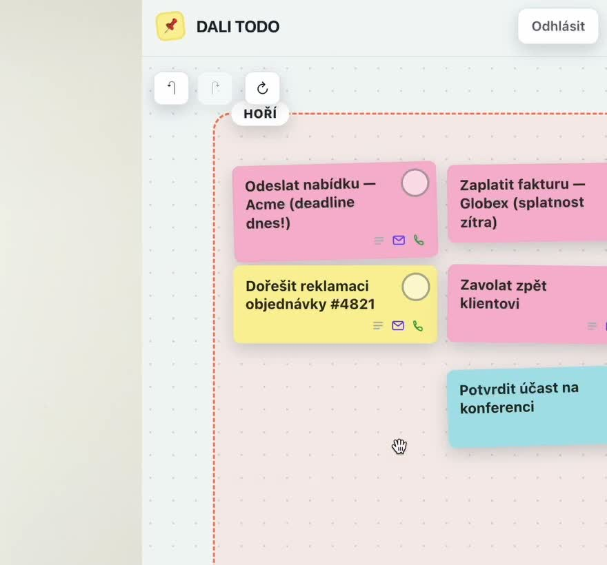
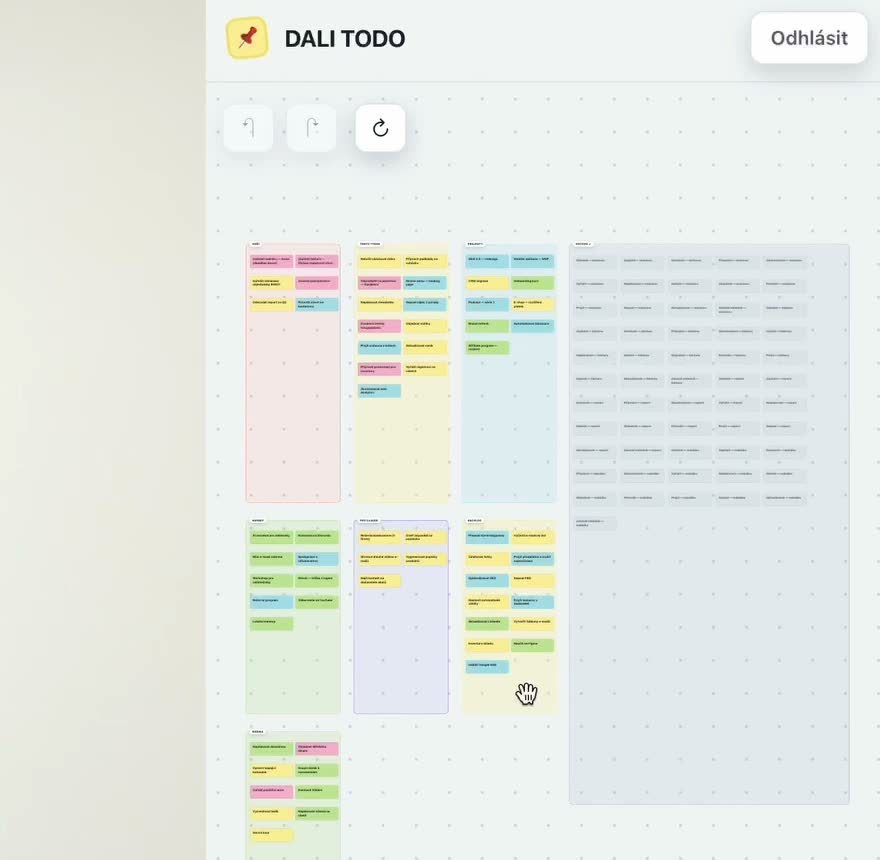
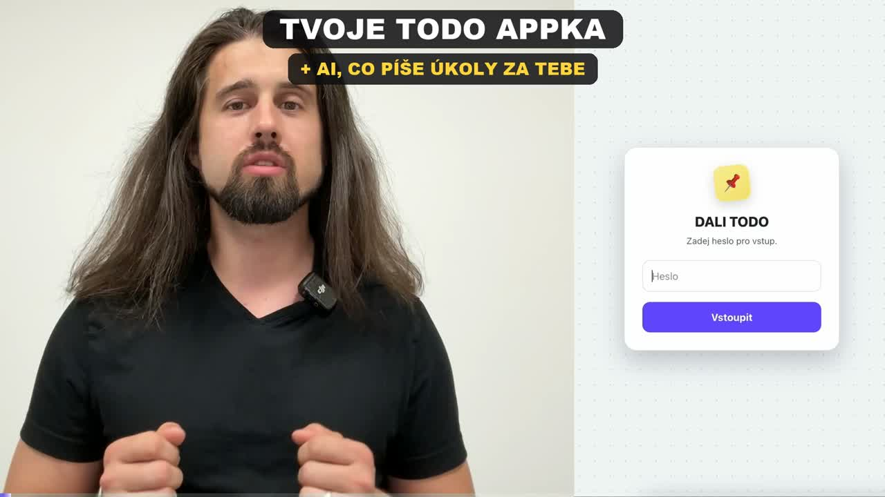
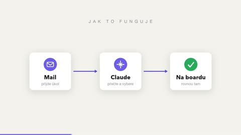
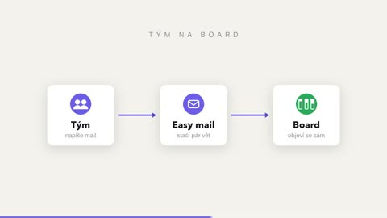
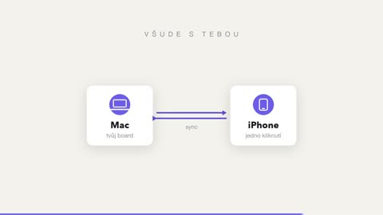
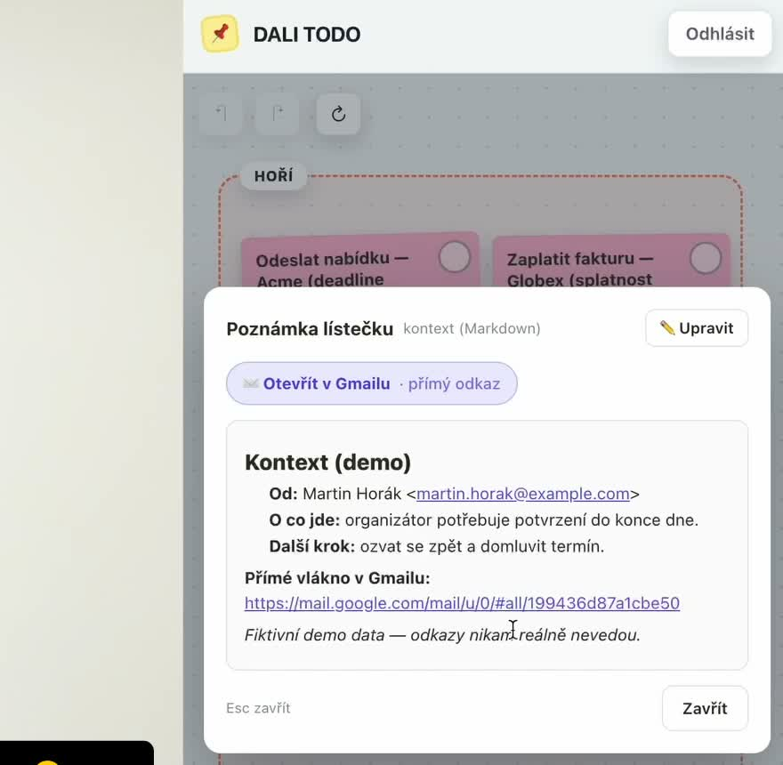
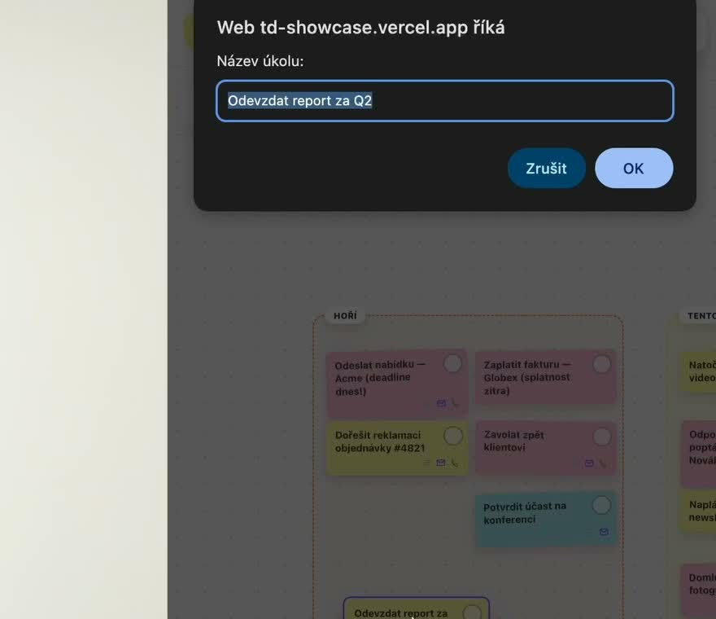
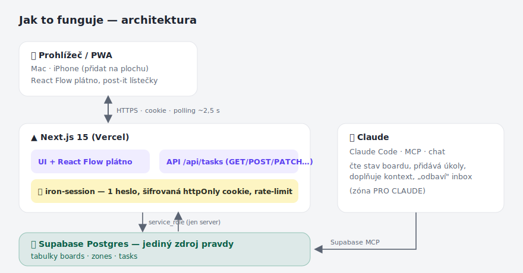
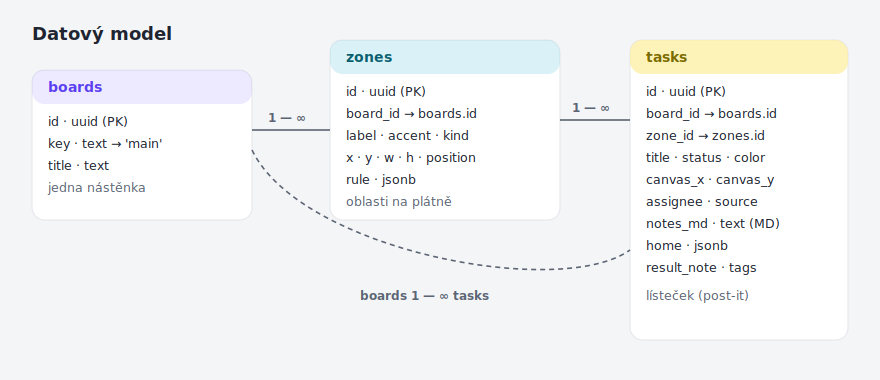

# 📌 DALI TODO — vizuální nástěnka úkolů

Osobní **vizuální nástěnka úkolů** — nekonečné plátno s post-it lístečky (jako Miro),
zaheslované, jen pro jednoho člověka. Ovládáš ji z počítače i mobilu a navíc ji umí
**číst i plnit AI agent** (Claude Code / MCP) — od přidávání úkolů z mailů až po jejich
vyřešení.



> Tohle je **čistá šablona** — bez dat, bez klíčů, bez cizích účtů. Naklonuješ, napojíš
> svůj Supabase + Vercel a máš vlastní běžící instanci za pár minut.
> (Screenshoty v tomhle README jsou z ukázkové instance s **fiktivními demo daty**.)

---

## ✨ Co to je

Klasické todo appky jsou seznamy. Tahle je **prostorová**: úkoly jsou barevné lístečky,
které si rozmístíš po plátně do **zón** (HOŘÍ, TENTO TÝDEN, PROJEKTY, …). Mozek si pamatuje
„kde co je" líp než řádky v seznamu — a na jeden pohled vidíš, co hoří a co počká.



Každý lísteček navíc nese **bohatý kontext v Markdownu** (`notes_md`) — detaily, odkazy,
celé pozadí úkolu. Díky tomu úkolu rozumí nejen ty, ale i AI agent, který ho pak může
**vyřešit za tebe** bez doptávání.

## 🧠 Proč to existuje (filozofie)

- **Prostor > seznam.** Zóny + barvy + pozice = rychlá orientace a klid v hlavě.
- **Jeden zdroj pravdy.** Vše žije v Supabase. Plátno je jen jeden z pohledů na ta data —
  takže to samé můžeš ovládat z appky, z mobilu i z Claude.
- **Agent jako spolupracovník.** Zóna **PRO CLAUDE** je „inbox pro AI". Co tam hodíš,
  to agent převezme, vyřeší a přesune do HOTOVO — s poznámkou, co udělal.
- **Kontext se neztrácí.** Markdown poznámka u každého lístečku drží vše podstatné
  (i přímý odkaz na e-mailové vlákno nebo telefon k zavolání).
- **Vlastní todo, žádný SaaS.** Nahradí Miro, Apple Úkoly i další placené appky —
  jeden vlastní nástroj, kde si funkce ladíš přesně pro sebe.

## 🎬 Jak to používám já (z video tutoriálu)

[](docs/images/video-hook.jpg)

Cíl byl vytvořit systém, kde uvidím všechny projekty a todos **v detailu i jako celek** —
a kde zapisuju **já i můj Claude**:



- **Ranní kolečko mailů.** Claude má na moje maily napojení *jen pro čtení*. Každé ráno si
  v rámci rutiny projde poslední poštu a podle šablon z ní vytáhne úkoly na board
  (příkaz [`/scan-maily`](.claude/commands/scan-maily.md)).
- **Kontext rovnou k lístečku.** Když Claude najde úkol, dohledá k němu základní kontext
  a zapíše ho jako **MD poznámku** — úkol pak jde vyřešit i bez čtení původního mailu.
- **Tým píše na board mailem.** Parťáci z týmů mi posílají „easy maily" a počítají s tím,
  že se jim úkol **sám objeví na boardu**.



- **HOTOVO ✓ jako paměť.** Odškrtnuté úkoly se skládají do zóny HOTOVO — vzniká databáze
  nových i odbavených věcí a Claude má vodítko, co už je vyřešené a co ještě ne.
- **Jedno kliknutí do konverzace.** Když je úkol „někomu odepsat", Claude přidá k lístečku
  odkaz na vlákno konverzace — a přes jeden klik jsi tam.
- **Rutiny odbavují samy.** Jednoduché úkoly zvládne agent vyřešit sám — např. průzkum
  řemeslníků s lepšími referencemi + návrhy mailů (kontext měl v MD poznámce);
  mně zbylo maily jen odeslat.
- **Všude s tebou.** Board mám na Macu i na iPhonu (PWA) — přidat úkol je jedno kliknutí
  a je to záznam, o kterém ví i Claude.



---

## 🚀 Klíčové funkce

| Funkce | Co dělá |
|---|---|
| 🟨 **Post-it plátno** | Nekonečné plátno (React Flow), přetahování lístečků, zoom, minimapa. |
| 🗂️ **Zóny** | Barevné oblasti (HOŘÍ / TENTO TÝDEN / PROJEKTY / NÁPADY / PRO CLAUDE / BACKLOG / RODINA / HOTOVO ✓). |
| 🎨 **Barvy & stavy** | `yellow` úkol · `pink` čeká na akci · `sky` info · `green`. Stavy `todo`/`doing`/`done` + agentní. |
| ✓ **Hotovo** | Klik na kolečko → lísteček zešedne, přeškrtne se a složí do zóny HOTOVO (mřížka). Vratné. |
| 📝 **Markdown poznámka** | Ke každému lístečku „za sebou" volný MD kontext — náhled i editor v popupu. |
| ✉️ 📞 **Rychlé akce z poznámky** | Z poznámky se samo vytáhne **odkaz na Gmail vlákno** a **telefon k zavolání** → jeden klik. |
| ↩️ **Undo / Redo** | Bezpečná historie (⌘Z / ⌘⇧Z), nikdy nemaže nesouvisející. |
| 🔄 **Živý sync** | Polling ~2,5 s → změny z jiného zařízení / od agenta naskočí samy. |
| 🔒 **Zaheslováno** | Jedno heslo (bcrypt hash), šifrovaná session, rate-limit, `noindex`. |
| 📱 **PWA** | „Přidat na plochu" na iPhonu, vlastní ikona, vydrží přihlášené. |
| 🤖 **Agent-ready** | `AGENTS.md` + příkaz pro skenování mailů → Claude umí board číst i měnit. |

|  |  |
|---|---|
| MD poznámka s tlačítkem do Gmail vlákna | nový lísteček = jedno kliknutí |

---

## 🛠️ Jak to funguje



- **Frontend:** Next.js 15 (App Router, TS) na Vercelu. Plátno = React Flow v *controlled*
  režimu → každý lísteček je řádek v Supabase s `canvas_x/y`.
- **Data:** Supabase Postgres = **jediný zdroj pravdy**. Server k němu sahá **service_role**
  klíčem, který je **jen na serveru** (nikdy v prohlížeči).
- **Auth:** vlastní middleware + iron-session (1 heslo jako hash v env, šifrovaná httpOnly cookie).
- **Sync:** realtime zatím přes polling (`/api/tasks` á ~2,5 s) + chytré sloučení.
- **Agent:** Claude přes Supabase MCP čte/přidává/řeší úkoly (viz `AGENTS.md`).

### Datový model



---

## ⚡ Rychlý start

```bash
# 1) klon + závislosti
npm install

# 2) databáze: ve svém Supabase projektu spusť SQL Editor a vlož celý
#    supabase/schema.sql  (vytvoří tabulky + nástěnku 'main' + zóny)

# 3) env: zkopíruj a vyplň
cp .env.example .env.local
openssl rand -base64 32          # → SESSION_PASSWORD
npm run hash -- "tvojeSilneHeslo" # → APP_PASSWORD_HASH
#   + doplň SUPABASE_URL a SUPABASE_KEY (service_role) z Project Settings → API

# 4) spusť
npm run dev                       # http://localhost:3000
```

📖 **Podrobný návod krok za krokem (Supabase + Vercel + iPhone):** [`docs/SETUP.md`](docs/SETUP.md)

---

## 🎯 Jak ji používat efektivně

Pár návyků, díky kterým z toho vytěžíš nejvíc (celé v [`docs/GUIDE.md`](docs/GUIDE.md)):

1. **Třiď do zón, ne do seznamu.** Ráno přetáhni 2–3 věci do **HOŘÍ**, zbytek nech v týdnu/backlogu.
2. **Barvu jako význam.** `pink` = „čeká na něčí odpověď / termín", `sky` = „jen info", `yellow` = „udělat".
3. **Plň poznámky.** Čím víc kontextu v `notes_md`, tím víc úkolů zvládne agent vyřešit sám.
4. **Deleguj na Claude.** Hoď úkol do **PRO CLAUDE** → agent ho převezme, vyřeší a přesune do HOTOVO.
5. **Skenuj maily.** Příkaz [`/scan-maily`](.claude/commands/scan-maily.md) projde poslední maily,
   porovná s boardem a **nové úkoly dopíše** (s kontextem) — nikdy nic nesmaže ani neduplikuje.
6. **Přímo do vlákna.** Když do poznámky napíšeš `Gmail thread <id>` nebo adresu, popup nabídne
   tlačítko, které tě **otevře rovnou do té konverzace** v Gmailu.

---

## 🤖 Pro AI agenta

Pokud do repa přijde Claude (Claude Code / Cowork), ať si první přečte **[`AGENTS.md`](AGENTS.md)** —
je tam, jak vidět stav boardu (SQL), konvence (zóny/barvy/stavy/pozice), vzor „agent inbox"
a jak bezpečně psát do `notes_md`.

---

## 🔐 Bezpečnost

- Heslo jen jako **bcrypt hash** (`APP_PASSWORD_HASH`), nikdy plaintext.
- Session: **httpOnly + Secure + SameSite=lax**, šifrovaná (iron-session), rolling ~90 dní.
- **Rate-limit** na login. **Maskování:** `noindex` + bezpečnostní hlavičky, nepřihlášený → login.
- Supabase klíč (`SUPABASE_KEY`, service_role) je **jen server-side** — žádný `NEXT_PUBLIC_`.
- `.env.local` se **necommituje** (je v `.gitignore`).

## 🧱 Stack

Next.js 15 · React 19 · TypeScript · @xyflow/react (React Flow) · Supabase (Postgres) ·
iron-session · bcryptjs · Tailwind v4 · Vercel.

## 📂 Struktura repa

```
src/
├─ app/                    # Next.js App Router (stránky + /api/tasks, /api/auth)
├─ components/
│  ├─ BoardClient.tsx      # React Flow plátno + undo/redo + sync + popup poznámky
│  ├─ TaskNode.tsx         # post-it lísteček (barvy, hotovo, ikonky mail/tel, LOD)
│  └─ ZoneNode.tsx         # zóna
└─ lib/
   ├─ tasks.ts             # datová vrstva (list/create/update/delete/sync)
   ├─ noteMeta.ts          # detekce Gmail vlákna / telefonu z poznámky
   ├─ markdown.tsx         # bezpečný Markdown → React (náhled poznámky)
   ├─ colors.ts · types.ts # paleta a typy
   └─ auth.ts · session.ts · supabase.ts
supabase/schema.sql        # databáze: tabulky + seed (nástěnka + zóny)
docs/                      # SETUP, GUIDE, obrázky
.claude/                   # konfigurace pro Claude Code + příkaz /scan-maily
AGENTS.md                  # průvodce pro AI agenta
```

---

## 📜 Licence a použití

**MIT** (viz [`LICENSE`](LICENSE)) — klidně si podle toho rozjeď **vlastní** instanci
(svůj Supabase + Vercel + svoje LLM), forkni, uprav. Branding „DALI TODO" si přejmenuješ
v `layout.tsx`, `manifest.ts` a `supabase/schema.sql` (title nástěnky).

Repo je šablona **bez dat**: žádné API klíče, žádné účty, žádné úkoly. Všechno ostré
si vyrobíš sám podle [`docs/SETUP.md`](docs/SETUP.md) — za ~15 minut běžíš.
